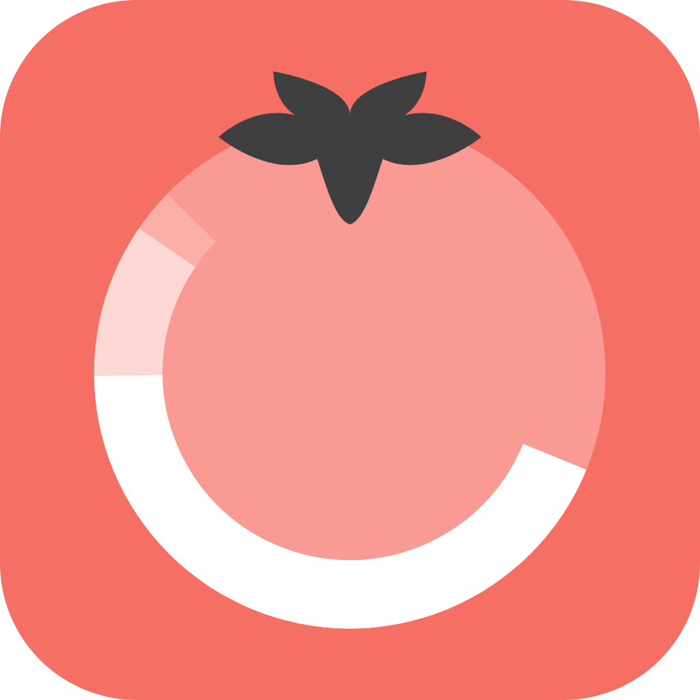

  
  <h1>Pommos</h1>
  <strong>A simple pomodoro timer written using Vue.js, Electron, Typescript, and Vite</strong>
  

## Development

The application is built with Electron and Vue.js. To run or build the app yourself, you'll need to have Node.js and Yarn installed.

### Running the app

1. Clone this repository: `git clone REPO_URL`
2. Navigate into the project directory: `cd pommos`
3. Install the dependencies: `yarn`
4. Run the app: `yarn start`

### Building the app

After cloning the repo and installing the dependencies, run `yarn build`. The packaged app can be found in the `dist_electron` folder.

## Contributing

### Features and Bugs

Suggestions and contributions are always welcome! Please first discuss changes via issue before submitting a pull request.